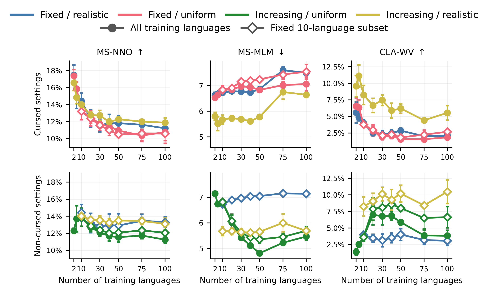

# There Is No Theoretical Curse of Multilinguality for Embedding Spaces

This repository contains the code for the project *There Is No Theoretical
Curse of Multilinguality for Embedding Spaces*. (TODO arxiv link)

Abstract:

> In multilingual NLP, we wish to achieve high monolingual performance as well
> as cross-lingual transfer with a multilingual model with large-scale language
> coverage. The *curse of multilinguality* describes the degradation in
> multilingual model performance as we increase language coverage, posing a
> threat to the above goal. This paper asks whether multilingual embedding
> spaces are inherently incapable of achieving perfect multilinguality without
> failure or a catastrophic increase in required capacity. We first formalize
> the goal of “perfect multilinguality,” embodied in two *multilinguality
> conditions*. We then prove that an embedding space can theoretically exhibit
> perfect multilinguality for increasing language coverage without a
> catastrophic increase in dimensionality. That is, we show that there is no
> theoretical curse of multilinguality for embedding space structure. This
> suggests that the empirical curse of multilinguality is a result of real
> world data and training conditions. We back this understanding with a
> small-scale empirical study on existing embedding spaces.

This repository contains the code for our empirical study.
Specifically, we formulate metrics for multilinguality conditions and observe whether they are maintained for models trained from scratch with increasing language coverage.

## Repository structure

- [`src/metrics/`](src/metrics/): implements the paper's intrinsic embedding-space
  metrics. See its [README](src/metrics/README.md) for definitions and formulas.
- [`src/scripts/run_metrics.py`](src/scripts/run_metrics.py): runs metric
  evaluation and writes results to `outputs/`.
- [`src/data/`](src/data/): loads and formats multiparallel evaluation datasets required for metric evaluation.
- [`src/models/`](src/models/): embedding-model wrappers and registry.
- [`src/training/`](src/training/): trains small BERT-style masked language
  models on increasingly large language sets varying compute, data, and target evaluation group settings. See its
  [README](src/training/README.md) for the full pipeline. Runs evaluation on above metrics.


## Main metrics

- **MS-NNO:** overlap between monolingual nearest-neighbor structure and a
  strong reference embedding space.
- **MS-MLM:** normalized masked-language-modeling loss, used as an indirect
  measure of monolingual quality.
- **CLA-WV:** cross-lingual alignment measured by retrieval of the correct
  translation among target-language concepts.
- **Non-degeneracy:** pairwise cosine-similarity statistics used to check that
  the embedding space does not collapse as language coverage grows.

## Trends of empirical curse of multilinguality for embedding space structure




If you use this code, please cite
```
TODO
```
